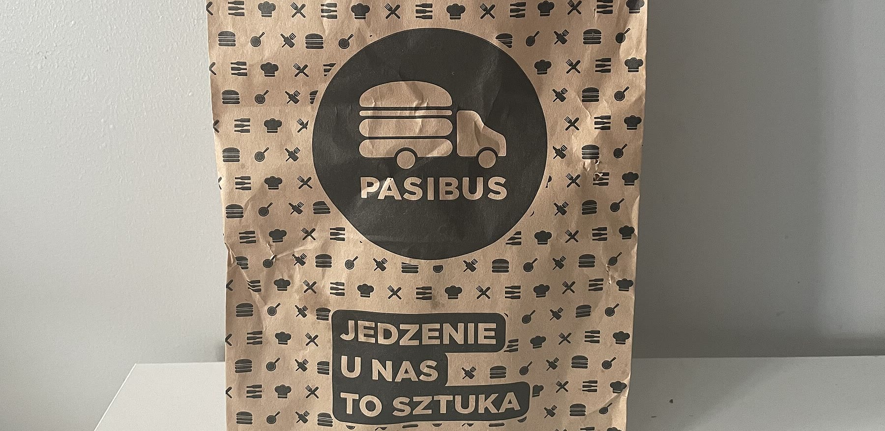

# Programowanie całkowitoliczbowe: optymalna dieta w Pasibusie



<sub>Fot. Szonlover, <a href="https://commons.wikimedia.org/wiki/File:Opakowanie_Pasibus.jpg">Wikimedia Commons</a>, CC BY-SA 4.0 (kadr).</sub>

Czy da się zjeść cały dzień w sieci burgerowej i zmieścić się w normach żywieniowych? Ile to kosztuje? Projekt rozwiązuje klasyczny problem diety Stiglera w wersji całkowitoliczbowej, bo burgery kupuje się w całych sztukach.

| | |
|---|---|
| **Dane** | 45 pozycji menu Pasibusa z Uber Eats (maj 2026): cena, kalorie, białko, tłuszcze, węglowodany, błonnik, cukry, sól, kofeina |
| **Normy** | IŻŻ, EFSA, WHO; osobno dla mężczyzny (M) i kobiety (K) w wieku 20–25 lat |
| **Model** | MILP: 45 zmiennych całkowitych (0–5 sztuk), 13 ograniczeń, minimalizacja kosztu |
| **Metody** | branch-and-bound · analiza scenariuszowa · diagnoza niewykonalności |
| **Narzędzia** | SAS `PROC LP` · Python: `scipy.optimize.milp` (HiGHS), `numpy`, `matplotlib` |
| **Kontekst** | projekt z Probabilistycznych i Deterministycznych Modeli Optymalizacji Decyzji, WNE UW, 2026 |

## Model

$$\min Z = \sum_{i=1}^{45} c_i x_i, \qquad x_i \in \{0, 1, \dots, 5\}$$

$c_i$ to cena pozycji $i$, a $x_i$ to liczba zamówionych sztuk. Ograniczenia to dolne i górne progi dla każdego składnika odżywczego.

## Najważniejsze wyniki

- **Przy pełnych normach problem jest niewykonalny** dla M i K. Żadna kombinacja pozycji nie spełnia jednocześnie widełek kalorii, limitu tłuszczu i progu błonnika.
- Zdjęcie jednego ograniczenia (tłuszcz, błonnik albo cukier) nie wystarcza. Rozwiązanie istnieje dopiero po **zluzowaniu tłuszczu i błonnika jednocześnie**. Przyczyną jest profil całego menu, a nie jedno ograniczenie.
- Po złagodzeniu norm optymalne menu kosztuje **60,97 zł (M)** i **75,96 zł (K)**.
- Mega Deal „3x Cziks + frytki” ma najlepszy w menu stosunek kalorii do ceny i stanowi 57% kosztu menu M. W wariancie K niższy limit kalorii wyklucza boxy.
- Tłuszcz w optimum: 135 g (M) przy zalecanym maksimum 105 g oraz 112 g (K) przy limicie 86 g.


## Pliki

| Plik | Zawartość |
|---|---|
| [`menu.csv`](menu.csv) | 45 pozycji menu z ceną i profilem odżywczym |
| [`normy.csv`](normy.csv) | widełki dziennego zapotrzebowania M i K ze źródłami |
| [`kod/model.sas`](kod/model.sas) | model `PROC LP` dla wszystkich scenariuszy |
| [`kod/run_sas.py`](kod/run_sas.py) | generator `model.sas` z plików CSV |
| [`kod/solve_local.py`](kod/solve_local.py) | weryfikacja modelu w Pythonie (HiGHS) |
| [`kod/make_outputs.py`](kod/make_outputs.py) | tabele i wykresy |
| [`wyniki/results.json`](wyniki/results.json) | wyniki wszystkich scenariuszy |

```bash
pip install numpy scipy
python kod/solve_local.py   # odtwarza wyniki/results.json
```

## Dane

| Zbiór | Źródło |
|---|---|
| ceny | [Uber Eats, Pasibus Nowy Świat](https://www.ubereats.com/pl/store/pasibus-nowy-swiat/gXk0BheTVMuFCk1dFTaHNg), maj 2026 |
| wartości odżywcze | [wykaz producenta (PDF)](https://pasibus.pl/wp-content/uploads/2026/04/pbsbsb_merged.pdf), [FatSecret](https://www.fatsecret.pl/kalorie-warto%C5%9Bci%C2%A0od%C5%BCywcze/pasibus) |
| zestawy i boxy | suma wartości składników |

## Licencja

Kod: [MIT](LICENSE). Zdjęcie: CC BY-SA 4.0, autor Szonlover.
