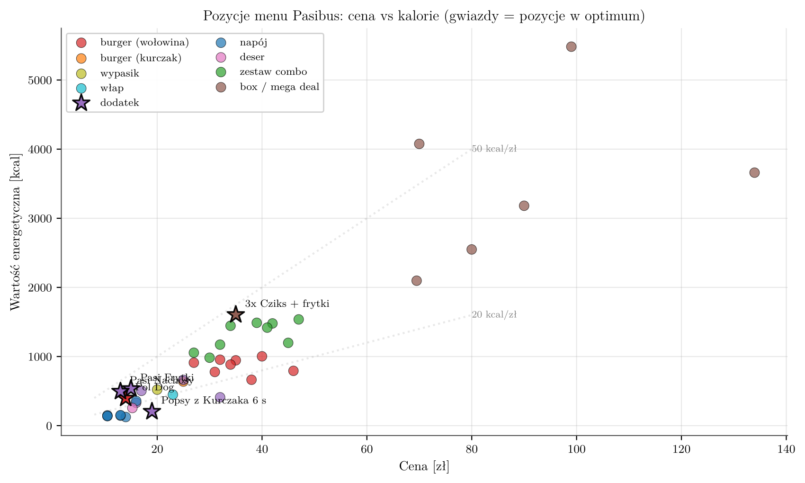

# Optymalna dieta studenta w Pasibusie

Projekt z Probabilistycznych i Deterministycznych Modeli Optymalizacji Decyzji (WNE UW, 2026). Wyznaczam minimalny koszt dziennego wyżywienia złożonego wyłącznie z pozycji jednej sieci burgerowej, przy spełnieniu norm żywieniowych IŻŻ, EFSA i WHO. To wariant klasycznego **problemu diety Stiglera** w wersji całkowitoliczbowej, bo pozycje kupuje się w pełnych sztukach.

**Metody:** programowanie całkowitoliczbowe (MILP) · metoda podziału i ograniczeń (branch-and-bound) · analiza scenariuszowa i diagnoza niewykonalności

**Narzędzia:** SAS (`PROC LP`) · Python (`scipy.optimize.milp`, `numpy`, `matplotlib`)



## Model

Zmienna $x_i \in \{0, 1, \dots, 5\}$ to liczba sztuk pozycji $i$ zamawianych w ciągu dnia (45 pozycji menu z Uber Eats, maj 2026).

$$\min Z = \sum_{i} c_i x_i$$

przy widełkach dla kalorii, białka, tłuszczu, tłuszczów nasyconych, węglowodanów, błonnika, cukrów wolnych, soli i kofeiny, osobno dla mężczyzny (M) i kobiety (K) w wieku 20–25 lat. Model ma 45 zmiennych i 13 ograniczeń, więc każda instancja rozwiązuje się w ułamku sekundy.

## Kluczowe wyniki

- **Warianty bazowe M i K są niewykonalne.** Nie istnieje kombinacja pozycji, która jednocześnie mieści się w widełkach kalorii, nie przekracza limitu tłuszczu i osiąga dolny próg błonnika. Dwa dowolne burgery wyczerpują dzienny limit tłuszczu.
- Diagnoza: zdjęcie osobno limitu tłuszczu, progu błonnika albo limitu cukru nie wystarcza. Dopiero **równoczesne zluzowanie tłuszczu i błonnika** daje rozwiązanie, więc bariera wynika z łącznego profilu produktów, a nie z jednego ograniczenia.
- Po złagodzeniu norm optymalne menu kosztuje **60,97 zł (M)** i **75,96 zł (K)**, czyli poniżej 100 zł przy pełnym pokryciu zapotrzebowania kalorycznego.
- Mega Deal „3x Cziks + frytki” to 57% kosztu menu mężczyzny i ma najlepszy w menu stosunek kalorii do ceny. W wariancie kobiety niższy limit kaloryczny eliminuje boxy.
- Tłuszcz w optimum: 135 g (M) przy zalecanym maksimum 105 g i 112 g (K) przy limicie 86 g.


## Pliki

| Plik | Co zawiera |
|---|---|
| [`menu.csv`](menu.csv) | 45 pozycji menu: cena i pełny profil odżywczy |
| [`normy.csv`](normy.csv) | widełki dziennego zapotrzebowania M/K ze źródłami |
| [`kod/model.sas`](kod/model.sas) | model `PROC LP` dla wszystkich scenariuszy |
| [`kod/run_sas.py`](kod/run_sas.py) | generator `model.sas` z plików CSV |
| [`kod/solve_local.py`](kod/solve_local.py) | niezależna weryfikacja MILP w Pythonie (HiGHS) |
| [`kod/make_outputs.py`](kod/make_outputs.py) | tabele i wykresy do raportu |
| [`wyniki/results.json`](wyniki/results.json) | wyniki solvera dla wszystkich scenariuszy |

```bash
pip install numpy scipy
python kod/solve_local.py   # odtwarza wyniki/results.json
```

## Dane

Ceny: Uber Eats, Pasibus Nowy Świat (maj 2026). Wartości odżywcze: oficjalny wykaz producenta i baza FatSecret. Dla zestawów i boxów profil odżywczy to suma składników.

## Licencja

Kod: [MIT](LICENSE).
